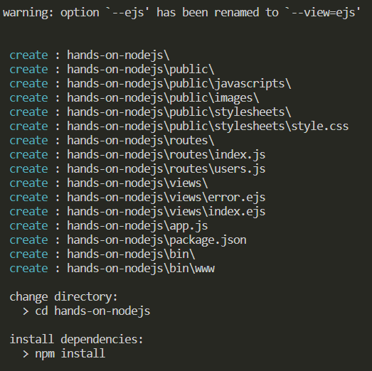
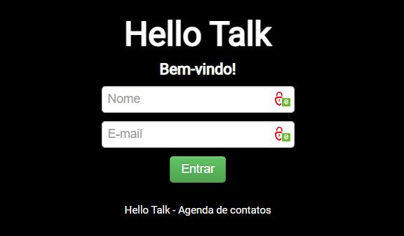

# Hands-on Node.js

Olá, bem-vindo ao **Hands-on Node.js**, esse repositório tem como objetivo ser um guia prático, direto ao ponto, sobre Node.JS.
 
O objetivo será desenvolver um passo a passo, que será listado nos *commits*, que será utilizado em conjunto com o Anki, ou qualquer outra ferramenta para revisão espaçada de conteúdo. O intuito aqui é manter o conhecimento vivo, mesmo que deixemos de trabalhar com Node em algum momento, ou foquemos mais em um framework e não iremos utilizar tanto o Node em sua essência.
 
É óbvio para todos que se não praticarmos esquecemos alguns pontos, mas acredite, às vezes esquecemos o básico e isso em algum momento pode fazer a diferença no desempenho das novas atividades diárias, ou se estivermos nós afastados desse mundo por algum motivo.

## Aviso

Nesse material não é abordado a instalação do Node.js, por ser uma atividade tão básica que não faz sentido alguém, com o mínimo de conhecimento em qualquer linguagem de programação, precisar de um guia para instalação de um serviço que é basicamente *next, next, next*. Se você precisa de ajuda com instalação, procure na internet! Aqui vamos  direto ao desenvolvimento. 

Logo, faço o download versão LTS do Node.js e comece a instalação enquanto você lê as próximas linhas.

Download em: https://nodejs.org

Você não precisa ser um programador JavaScript para entender a maior parte dos exercícios que iremos fazer aqui, se já estudou algoritmos ou já programa em qualquer linguagem de programação, vamos em frente, se nunca programou... vamos também, se você patinar em algo, faça uma pergunta no StackOverflow, faça o curso do Gustavo Guanabara, só não venha me perguntar. ~~Pode perguntar, mas vou te zoar.~~ 

Este projeto foi desenvolvido utilizando o **Express 4.16.1**.

# Express.JS

**Express.js** é um framework para aplicações Node.js, especialmente construído para o desenvolvimento de aplicações hibridas. Como todo bom framework, seu principal objetivo é acelerar o desenvolvimento dessas aplicações.

Entre suas características podemos destacar que ele é:
- MVR (Model-View-Routes);
- MVC (Model-View-Controller);
- Roteamento de URLs via callbacks;
- Middleware;
- Interface RESTFul;
- Suporte a File Uploads;
- Configuração baseado em variáveis de ambiente;
- Suporte a helpers dinâmicos;
- Integração com Template Engines;
- Integração com SQL e NoSQL.

A instalação é bem simples, começamos pelo seu gerenciador através do seguinte comando: 

```bash
npm install -g express-generator
```

Após instalado é necessário fechar o terminal e abrir novamente. Se você tiver feito a instalação pela IDE, feche a IDE. 

Agora vamos criar um projeto, que vamos chamar de **hands-on-nodejs**: 

```bash
express hands-on-nodejs --ejs
cd hands-on-nodejs
npm install
```
Muito bem, acabamos de gerar o *scaffold* do projeto, ou seja, o *esqueleto* do nosso projeto. 



### O que foi criado: 

A estrutura de pasta é bem similar ao de muitos outros frameworks, temos apenas alguns itens que são característicos do projeto. Basicamente o que deve ter sido criado é:  

- package.json: esse você já sabe, contém as principais informações sobre a aplicação, como nome, autor, versão, colaboradores, URL, dependências, etc;
- public: pasta pública que armazena conteúdo estático, por exemplo, imagens, CSS, JavaScript etc.;
- app.js: arquivo que inicializa o servidor do projeto através do comando **node app.js**;
- routes: diretório que mantém todas as rotas da aplicação;
- views: diretório que contém todas as views que são renderizadas pelas rotas;
- bin: diretório com um arquivo que permite iniciar a aplicação via linha de comando.

Quando rodamos o **npm install** o Node instalou todas as dependências esperadas no projeto, confira que foram analisando o arquivo **package.json**, como o  EJS (Embedded Javascript) e alguns *middlewares* do Express: debug, body-parser, static favicon, morgan e o cookie-parser. 

Altere o arquivo **package.json** com as informações sobre o projeto, lembre-se que o atributo *name* é o mais importante do projeto, pois é a partir dele que o pacote pode ser instanciado. 

Vamos desenvolver um projeto no padrão **CommonJS**, para isso vamos ao nosso app.js.

```js
var express = require('express'),
	routes = require('./routes/index'),
	users = require('./routes/users'),
	app = express();

app.set('views', `${__dirname}/views`);
app.set('view engine', 'ejs');
app.use(express.static(`${__dirname}/public`));
app.use('/', routes);
app.use('/users', users);
app.listen(3000, function () {
	console.log("Hello Talk is ready!");
});
```

### Explicando do código

- **express()**: função que habilita as funcionalidades do framework para que possamos utilizar;
- **app**: variável que recebe as funcionalidades de *express()*;
- **app.listen()**: alias que coloca a aplicação *online*;
- **app.set(chave, valor)**: estrutura para configuração dos *middlewares* do Express.JS. Aqui configurações até agora só template engine EJS e o servidor de arquivos estáticos.
- **app.use(express.static(`${__dirname}/public`))**: nossa rota estática para a pasta */public*, vamos utilizar para salvar *imagens*, *css* e *js* que será utilizadas nas páginas renderizadas no navegador;
- **app.use('/', routes)**: nossa rota para o *index*;
- **app.use('/users', users)**: rota para a página de usuários;

### Express.js | app.use() Function

A função app.use() é utilizada para definir o caminho para uma ou mais funções de um middleware específico.

Sintaxe: 
```js
app.use(path, callback)
```
### Parâmetros
Parâmetros:
- *path*: o caminho para o qual a função do middleware está sendo chamada. Pode ser uma string representando um padrão de caminho ou *path pattern* (caminho padrão) de expressão regular para corresponder aos caminhos;
- *callback*: a função do middleware ou uma serie/array de funções do middleware.


## Estrutura de pastas

Nossa estrutura de pastas irá seguir o padrão MVC. Basicamente termos o padrão de *models*, *views* e *controllers* além disso teremos nossa rotas (*routes*) e o diretório público (*public*). Futuramente você poderá aplicar algum *design pattern* de sua preferência.

Na imagem do tópico anterior podemos ver que, por padrão, o **Express** criou as pastas:

- **bin**;
- **public**;
- **routes**;
- **views**.

Iremos criar mais alguns pastas para seguir o padrão MVC e outras exclusivas para esse projeto. Sendo elas: 

- **doc**: documento anexos exclusivos para o repositório no Git;
- **models**: para interações com o banco de dados e APIs. 
- **controllers**: para definir o fluxo de informações no sistema e regras de negócio.

Para utilizarmos nossos *models* nos *controllers* fazemos uma chamado via *require('/models/nome-do-model')*. Muitas chamadas utilizando *require* podem poluir o código e perderemos em desempenho, felizmente o **Express** tem um *plugin* que mapeia os diretórios e insere nos módulos, o **express-load**. Via função **load('módulos').into(app)** podemos fazer esse controle. Mas primeiro precisamos incluir o *plugin* no projeto via NPM. 

```bash
npm install express-load --save
```

Então vamos refatorar nosso código anterior para que você possa entender como ficará o projeto: 

```js
var express = require('express'),
	load = require('express-load'),
	app = express();
app.set('views', __dirname + '/views');
app.set('view engine', 'ejs');
app.use(express.static(__dirname + '/public'));
load('models')
	.then('controllers')
	.then('routes')
	.into(app);
app.listen(3000, function () {
	console.log("Hello Talk is ready!");
	console.log(__dirname);
}); 
```
É importantes que as pastas models e controllers sejam criadas e os arquivos da pasta routes sejam excluídos antes de tentarmos 

Carregue nessa ordem: 
1. models;
2. controllers;
3. views.

Vamos criar um arquivo *routes/home.js* com o seguinte código:
```js 
module.exports = function (app) {
	var home = app.controllers.home;
	app.get('/', home.index);
};
```
Pelo **express-load** no *app.controllers.home* estamos referenciando o arquivo */controllers/home.js* e pela variável *app* estamos *chamando* esse controller. Agora vamos criar esse controller */controllers/home.js*: 

```js
module.exports = function (app) {
	var HomeController = {
		index: function (req, res) {
			res.render('home/index');
		}
	};
	return HomeController;
};
```

Por fim, vamos criar nossa primeira view EJS em */views/home/index.ejs*, que nesse primeiro momento faremos apenas o "html": 

```html
<!DOCTYPE html>
<html>

<head>
	<meta charset="utf-8">
	<title>Hello Talk - Agenda de contatos</title>
</head>
<body>
	<header>
		<h1>Hello Talk</h1>
		<h4>Bem-vindo!</h4>
	</header>
	<section>
		<form action="/login" method="post">
			<input type="text" name="user[name]" placeholder="Nome">
			<br>
			<input type="text" name="user[email]" placeholder="E-mail">
			<br>
			<button type="submit" class="btn btn-success">Entrar</button>
		</form>
	</section>
	<footer>
		<small>Hello Talk - Agenda de contatos</small>
	</footer>
</body>
</html>
```
Nesse projeto não vamos explicar e muito menos focar em CSS, por esse motivo, estamos usando o Bootstrap v2.3.1 para estilizar o formulário, por dois motivos, é leve e pequeno. Você pode baixar a mesma versão no site do projeto ou utilizar a mais moderna durante seus exercícios. Lógica por sua conta.




## Estruturando views

Quando falamos em *views* é esperando trabalhar com componentes para seções da página, usualmente, *head*, *body* e *footer*, afinal, vamos reutilizar recursos e evitar códigos repetitivos e que transformam qualquer projeto em um inferno. No  EJS isso é chamado de **partials**, os arquivos *parciais* de um projeto. Por esse motivo, vamos criar esses arquivos em */views/partials*.

Vamos criar o */views/partials/head.ejs*: 

```html
<html>
	<head>
		<meta charset="utf-8">
		<title>Hello Talk  - Agenda de contatos</title>
	</head>
	<body>
```

E o */views/partials/footer.ejs*:

```html
	<footer>
		<small>Hello Talk - Agenda de contatos</small>
	</footer>
</html>
```

Agora vamos importar os nosso *partials* na *home.ejs*.

```html
<%- include ('../partials/head.ejs'); %>
	<body>
		<header>
			<h1>Hello Talk</h1>
			<h4>Bem-vindo!</h4>
		</header>
		<section>
			<form action="/login" method="post">
				<input type="text" name="user[name]" placeholder="Nome">
				<br>
				<input type="text" name="user[email]" placeholder="E-mail">
				<br>
				<button type="submit" class="btn btn-success">Entrar</button>
			</form>
		</section>
	</body>
<%- include ('../partials/footer.ejs'); %>
```

Duas observações sobre o código acima: 
1. geralmente o **head** é desenvolvido dentro de um arquivo chamado *header.ejs*, para o entendimento desse treinamento, vamos chamar de *head.ejs*, pois vamos utilizar a tag principal do arquivo. Afinal, temo uma outra tag chamada *header* no nosso arquivo.
2. semanticamente o *footer* deve ficar dentro do *body*, mas vamos colocar fora para organizar melhor os nossos documentos. 

## Sessões de usuário

Sim meus amigos, agora vamos o que importa, desenvolver nossas sessões de usuário, que pelo **Express** é muito simples. Os dados aqui são manipulados via JSON e podemos fazer isso via *req.session*. 

Para isso, vamos precisar incluir mais um módulo no nosso projeto. O *express-session*. Faremos isso via terminal: 

```bash
npm install express-session --save
```

Agora vamos criar duas novas rotas no nosso arquivo de rotas, sendo essas */login* e */logout*, ambas no */routes/home.js*. 

```js
module.exports = function (app) {
	var home = app.controllers.home;
	app.get('/', home.index);
	app.post('/login', home.login);
	app.get('/logout', home.logout);
};
```

Não tem muito segredo, não é mesmo? *Login* é um *post* e *logout* um *get*. Afinal o login receberá os dados do formulário e o logout sera chamado atrás vezes um link.

No nosso arquivo */controllers/home.js* vamos implementar nova *actions* para tratar as novas rotas e validar o login por usuário e senha. 

```js
module.exports = function (app) {
	var HomeController = {
		index: function (req, res) {
			if (req.session.user != undefined) {
				user = req.session.user;
				res.render('home/index', user);
			} else {
				user = undefined;
				res.render('home/index', user);
			}
		},
		login: (req, res) => {
			var user = req.body.user;
			user['contacts'] = [];
			req.session.user = user;
			console.log(req.session.user);
			res.redirect('/');
		},
		logout: (req, res) => {
			req.session.destroy();
			res.redirect('/');
		}
	};
	return HomeController;
};
```

Para fechar, vamos criar uma *partial* chamada */views/exit.ejs* que será exibida apenas para o usuário logado e permita fazer o logout.

```js
<section>
	<% if (user == undefined) { %><!-- Se usuário logado -->
		<% } else { %>
			<span>Logado como <strong><%= user.name %></strong></span>
			<p><a class="btn btn-danger" href='/logout'>Sair</a></p>
	<% } %>
</section>
```

Altere as views criadas para incluir a seção de saída. 

Por fim, altere o arquivo app.js de forma a tratar as novas execuções.

```js
var express = require('express'),
	load = require('express-load'),
	bodyParser = require('body-parser'),
	cookieParser = require('cookie-parser'),
	expressSession = require('express-session'),
	app = express();
app.set('views', __dirname + '/views');
app.set('view engine', 'ejs');
app.use(cookieParser('helloTalk'));
app.use(expressSession());
app.use(bodyParser.json());
app.use(bodyParser.urlencoded({ extended: true }));
load('models')
	.then('controllers')
	.then('routes')
	.into(app);
app.listen(3000, function () {
	console.log("Hello Talk is ready!");
	console.log(__dirname);
});
```

O módulo *body-parser* para receber os dados enviados pelo requisição via HTTP e o módulo *cookie-parser* que preenche a propriedade *res* do objeto request no nosso controller *(req. res)*. 

## Rotas no padrão restful

Vamos começar a trabalhar com rotas no padrão *restful* para manipular a nossa lista de contatos, para isso vamos começar criando uma pasta *contact/views* e nesta pasta vamos criar os arquivos *index.ejs*. Vamos fazer um CRUD usando as sessões de usuário para manipular os dados. Obviamente os dados serão perdidos ao reiniciarmos o serviço. Em outro momento vamos persistir esses dados em um banco, mas nesse momento nos focar em trabalhar os métodos.

Precisamos instalar mais um módulo no nosso projeto, o *method-override*, que irá nos permitir usar o métodos HTTP como *PUT* ou *DELETE* em locais onde o cliente não oferece suporte, no nosso caso, o navegador.

```bash
npm install method-override --save
```

Após instalar, vamos incluir a chamada ao método no nosso app.js: 

```js
var express = require('express'),
	load = require('express-load'),
	bodyParser = require('body-parser'),
	cookieParser = require('cookie-parser'),
	expressSession = require('express-session'),
	methodOverride = require('method-override'),
	app = express();
app.set('views', __dirname + '/views');
app.set('view engine', 'ejs');
app.use(cookieParser('helloTalk'));
app.use(expressSession());
app.use(bodyParser.json());
app.use(bodyParser.urlencoded({ extended: true }));
app.use(methodOverride('_method'));
app.use(express.static(__dirname + '/public'));
load('models')
	.then('controllers')
	.then('routes')
	.into(app);
app.listen(3000, function () {
	console.log("Hello Talk is ready!");
	console.log(__dirname);
});
```

O *methodOverride('_method')* será um *middleware* que irá permitir que uma mesma rota seja reaproveitada pelos métodos HTTP. Essa é a sobrescrita de métodos do HTTP.

Vamos criar dois arquivos. O primeiro chamado */routes/contact.js* para definirmos as rotas que iremos trabalhar e o segundo */middlewares/authenticator.js*: queria garantir que o somente usuários logados possam visualizar a lista de contatos e impedir que ocorram erros no abrir uma URL que requer autenticação. 

**/routes/contact.js**

```js
module.exports = function (app) {
	var auth = require ('../middlewares/authenticator.js');
	var contacts = app.controllers.contacts;
	app.get('/contacts', auth, contacts.index);
	app.get('/contact/:id', auth, contacts.show);
	app.post('/contacts', auth, contacts.create);
	app.get('/contact/:id/editar', auth, contacts.edit);
	app.put('/contact/:id', auth, contacts.update);
	app.delete('/contact/:id', auth, contacts.destroy);
};
```

Vamos trabalhar com 4 métodos, *GET*, *POST*, *PUT* e *DELETE*, o básico do *CRUD*. Ao funções do nosso *app* já são conhecidas, porém, aqui estamos passando uma função a mais como *callback*, que é a *auth*, para garantir que os contatos só poderão ser visualizadas por usuários logados. Para isso vamos criar o nosso *middleware* *authenticator*, que incluímos no início da nossa rota.   

**/middlewares/authenticator.js**
```js
module.exports = function (req, res, next) {
	if(!req.session.user) {
		return res.redirect('/');
	}
	return next();
}
```

Agora vamos definir no nosso *controller* como as rotas serão tradas. Para isso vamos editar o */controllers/contacts.js*. Aqui, conforme previsto pelo que definimos na rota, vamos criar as funções *index*, *show*, *create*, *edit*, *update*, *destroy*. Siga o código.

```js
module.exports = function (app) {
	var ContactsController = {
		index: function (req, res) {
			var user = req.session.user,
				contacts = user.contacts,
				params = {
					user: user,
					contacts: contacts
				};
			res.render('contacts/index', params);
		},
		create: function (req, res) {
			var contact = req.body.contact, 
			user = req.session.user;
			user.contacts.push(contact);
			console.log(user);
			res.redirect('/contacts');
		},
		show: function (req, res) {
			var id = req.params.id,
			contact = req.session.user.contacts[id],
			params = {contact: contact, id: id};
			res.render('contacts/show', params);
		},
		edit: function (req, res) {
			var id = req.params.id,
			user = req.session.user,
			contact = user.contacts[id]
			params = {
				user: user,
				contact: contact, 
				id: id
			};
			res.render('contacts/edit', params);
		},
		update: function (req, res) {
			var contact = req.body.contact,
			user = req.session.user;
			user.contacts[req.params.id] = contact;
			res.redirect('/contacts');
		},
		destroy: function (req, res) {
			var user = req.session.user,
			id = req.params.id;
			user.contacts.splice(id, 1);
			res.redirect('/contacts')
		}
	};
	return ContactsController;
};
```

Agora vamos para parte visual, criando nossas views */views/contacts/index.ejs*, */views/contacts/show.ejs* e */views/contacts/edit.ejs*

A página principal da nossa lista de contatos */views/contacts/index.ejs*, que terá uma tabela com os nossos contatos:
```html
<%- include ('../partials/head.ejs'); %>
<header>
	<h2>Hello Talk - Agenda de contatos</h2>
</header>
<section>
	<form action="/contacts" method="post">
		<input type="text" name="contact[name]" id="contact[name]" placeholder="Nome"/>
		<input type="text" name="contact[email]" id="contact[email]" placeholder="E-mail"/>
		<button type="submit" class="btn btn-primary">Cadastrar</button>
	</form>
	<table class="table">
		<thead>
			<tr>
				<th>Nome</th>
				<th>E-mail</th>
				<th>Ação</th>
			</tr>
		</thead>
		<tbody>
			<% contacts.forEach(function(contact, index) { %>
				<tr>
					<td><%- contact.name %></td>
					<td><%- contact.email %></td>
					<td>
						<a href="/contact/<%- index %>">Detalhes</a>
					</td>
				</tr>
			<% }) %>
		</tbody>
	</table>
</section>
<%- include ('../partials/exit.ejs'); %>
<%- include ('../partials/footer.ejs'); %>
```

Para exibir os detalhes do nosso contato teremos a view */views/contacts/show.ejs*: 
```html
<%- include ('../partials/head.ejs'); %>
<header>
	<h2>Hello Talk - Dados do contato</h2>
</header>
<section>
	<form action="/contact/<%- id %>?_method=delete" method="post">
		<p><label>Nome:</label><%- contact.name %></p>
		<p><label>E-mail:</label><%- contact.email %></p>
		<p>
			<button class="btn btn-danger" type="submit">Excluir</button>
			<a href="/contact/<%- id %>/editar" class="btn btn-warning" >Editar</a>
		</p>
	</form>
</section>
<%- include ('../partials/exit.ejs'); %>
<%- include ('../partials/footer.ejs'); %>
```

Por fim a */views/contacts/edit.ejs* será nossa página para edição do contato:
```html
<%- include ('../partials/head.ejs'); %>
<header>
	<h2>Hello Talk - Editar contato</h2>
</header>
<section>
	<form action="/contact/<%- id %>?_method=put" method="post">
		<label>Nome:</label>
		<input type="text" name="contact[name]" value="<%- contact.name %>">
		<label>E-mail:</label>
		<input type="text" name="contact[email]" value="<%- contact.email %>">
		<p>
			<button type="submit" class="btn btn-success" >Atualizar</button>
		</p>
	</form>
</section>
<%- include ('../partials/exit.ejs'); %>
<%- include ('../partials/footer.ejs'); %>
```

Repare que nas telas de detalhes e edição dos contatos o *method* utilizado é o *POST* e é passando um parâmetro na *action*,*_method=put* e *_method=delete* respectivamente. Esses parâmetros são necessário para o funcionamento do **method-override**, através da função *methodOverride('_method')* que definimos no nosso arquivo *app.js*, uma vez que o cliente não reconhece os métodos *PUT* e *DELETE* ao enviar um formulário. 


## Criando uma página 404 

Conhecemos os possíveis erros reportados pelo HTTP, o mais comum, é claro, o 404 (página não encontrada), outros também poderão acontecer, por isso vamos criar uma página específica para retornar nossos erros de forma amigável para o usuário. 

Vamos desenvolver primeiro a */views/not-found.ejs*.

```html
<%- include ('./partials/head.ejs'); %>
	<header>
		<h1>Hello Talk - Página não encontrada!</h1>
		<h4>Essa página não existe :(</h4>
		</header>
	<hr>
	<p>Voltar a <a href="/">home page?</a> :)</p>
<%- include ('./partials/footer.ejs'); %>
```

Vamos desenvolver a */views/server-error.ejs* para apresentar mensagem de erro do servidor.

```html
<%- include ('./partials/head.ejs'); %>
	<header>
		<h1>Hello Talk - Erro!</h1>
		<h4>Ops! Algo deu errado :(</h4>
	</header>
	<p>
		Veja os detalhes do erro:
		<br>
		<%- error.message %>
	</p>
	<hr>
	<p>Voltar a <a href="/">home page?</a> :)</p>
<%- include ('./partials/footer.ejs'); %>
```

Agora vamos criar uma novo *middleware* para tratar as mensagens de erro em *middlewares/error.js*

```js
exports.notFound = function (req, res, next) {
	res.status(404);
	res.render('not-found')
}; 

exports.serverError = function (error, req, res, next){
	res.status(500);
	res.render('server-error', {error: error});
}
```

Por fim, vamos alterar nosso *app.js* para tratar as mensagem de erro. Repare que as chamadas devem ser realizada após o carregamento dos controllers.


```js
var express = require('express'),
	load = require('express-load'),
	bodyParser = require('body-parser'),
	cookieParser = require('cookie-parser'),
	expressSession = require('express-session'),
	methodOverride = require('method-override'),
	error = require('./middlewares/error'),
	app = express();
app.set('views', __dirname + '/views');
app.set('view engine', 'ejs');
app.use(cookieParser('helloTalk'));
app.use(expressSession());
app.use(bodyParser.json());
app.use(bodyParser.urlencoded({ extended: true }));
app.use(methodOverride('_method'));
app.use(express.static(__dirname + '/public'));
load('models')
	.then('controllers')
	.then('routes')
	.into(app);
app.use(error.notFound);
app.use(error.serverError);
app.listen(3000, function () {
	console.log("Hello Talk is ready!");
	console.log(__dirname);
});
```

# Referências

- https://www.geeksforgeeks.org/express-js-app-use-function/#:~:text=The%20app.,up%20middleware%20for%20your%20application.
- https://expressjs.com/en/starter/static-files.html
- https://getbootstrap.com/
- https://www.digitalocean.com/community/tutorials/how-to-use-ejs-to-template-your-node-application-pt